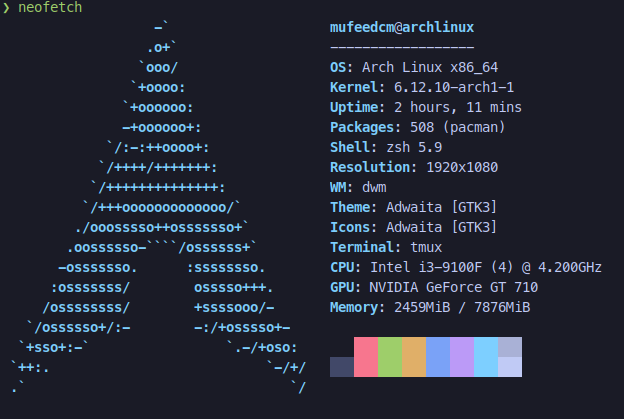

# Dotfiles Repository

This repository contains my personal dotfiles for various systems, including **Linux**, **Android**, and **Windows**. It helps me maintain a consistent environment across different platforms.

---

## Table of Contents

- [Current System Specifications](#current-system-specifications)
- [Installation Guide](#installation-guide)
- [Linux Dotfiles](#linux-dotfiles)
- [Android Dotfiles](#android-dotfiles)
- [Windows Dotfiles](#windows-dotfiles)
- [How to Use](#how-to-use)

---

## Current System Specifications

| **Component**           | **Details**                                     |
|-------------------------|-------------------------------------------------|
| **OS**                  | Arch Linux | Windows | Termux                    |
| **Processor**           | Intel© Core™ i3-9100F CPU @ 3.60GHz × 4         |
| **Graphics Card**       | Gigabyte Nvidia Geforce GT 710                  |
| **MotherBoard**         | Asus Prime H310M-E R2.0                         |
| **Memory**              | Adata DDR4 2400 8GB                             |
| **SSD**                 | Maxtor Z1 240GB SATA 6Gb/s                      |

---



---

## Installation Guide

### for Arch Linux
[My Personal Arch Installation Guide](./linux/archinstall.md)

### for Windows
*(coming soon)*

### for Android
[My Personal Android Installation Guide](./android/README.md)

---

## Linux Dotfiles

The [linux](./linux/) folder contains my personal dotfiles used on my Arch Linux system.

It includes configurations for:
- Window Manager (dwm)
- Editor (Neovim)
- Shell (Zsh)
- Terminal Emulator (st)
- Other essential utilities

---

## Android Dotfiles

The [android](./android/) folder contains configurations for my Android setup.

---

## Windows Dotfiles

The [windows](./windows/) folder contains configurations for my Windows setup.

---

## How to Use

### Cloning the Repository

To use these dotfiles, clone this repository to your home directory:

```bash
git clone https://github.com/mufeedcm/dotfiles.git ~/dotfiles
```

>Feel free to open an issue or send a pull request if you spot any mistakes or have suggestions. I'd really appreciate your feedback! Let me know if you need any changes or have more ideas.
