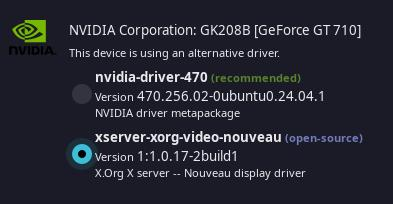

## Current System Specifications

- **OS:** Linux Mint 22 Cinnamon
- **Window Manager (WM):** i3wm
- **Linux Kernel:** 6.8.0-38-generic
- **Processor:** Intel© Core™ i3-9100F CPU @ 3.60GHz × 4
- **Memory:**  
- **HDD:** 
- **SSD:** 
- **Graphics Card:** NVIDIA Corporation GK208B [GeForce GT 710]
- **Graphics Driver:** 

---

## Installation Guide

### Step 1: Run the Setup Script

To set up your system, follow these steps:

1. **Update and install prerequisites**:
    ```bash
    sudo apt update && apt upgrade -y
    sudo apt install git stow -y
    ```

2. **Clone your dotfiles repository and run the installation script**:
    ```bash
    cd ~
    git clone https://github.com/mufeedcm/dotfiles
    cd ~/dotfiles/linux/
    chmod +x install.sh
    ./install.sh
    ```
---
